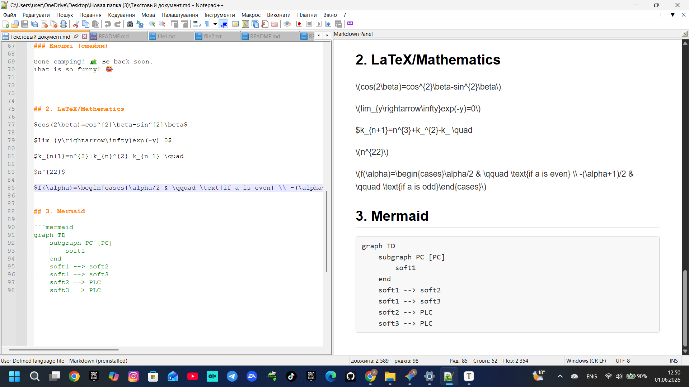
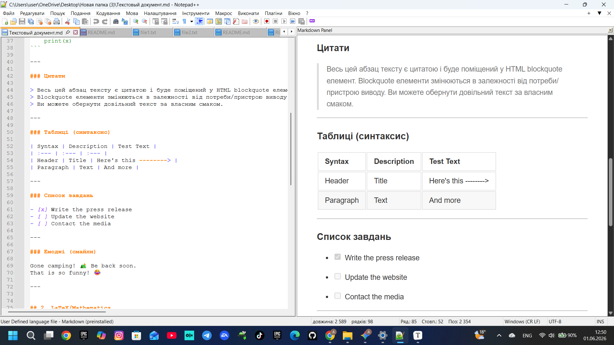
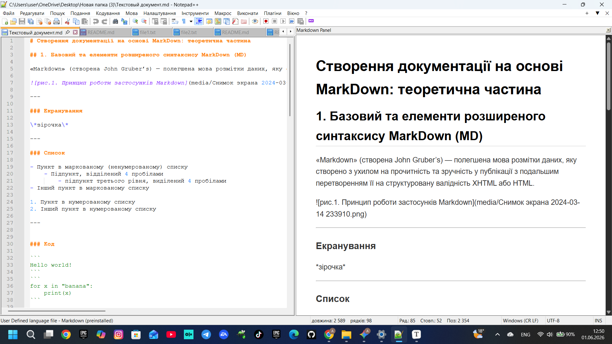
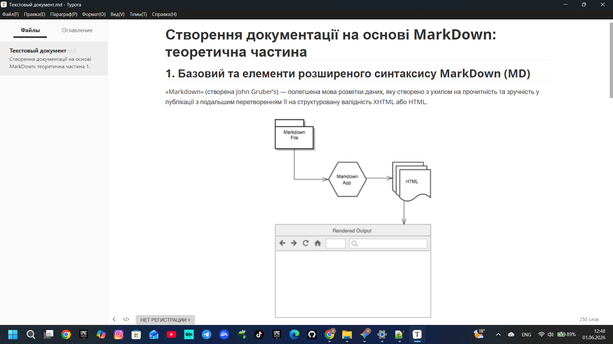
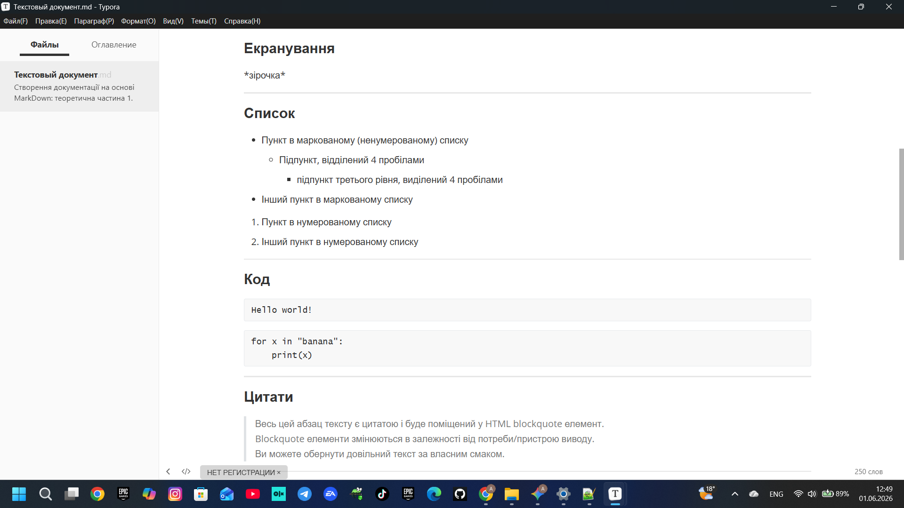
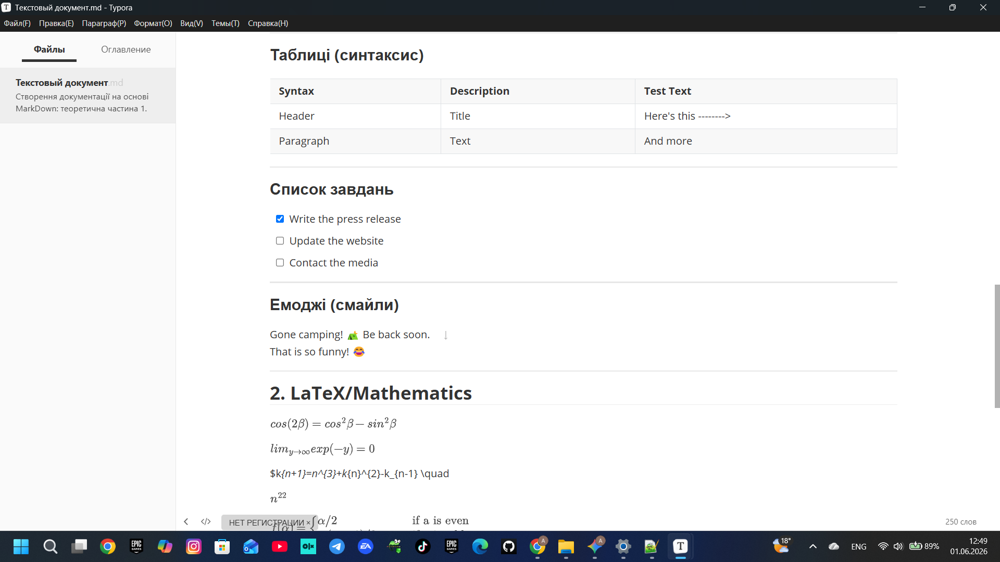
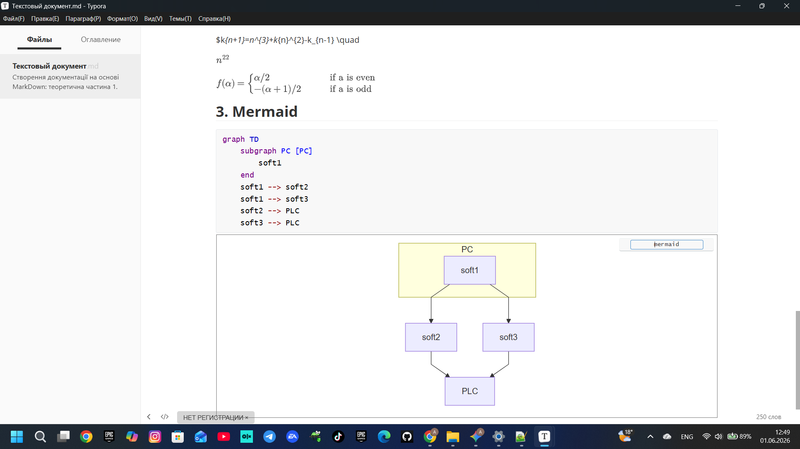
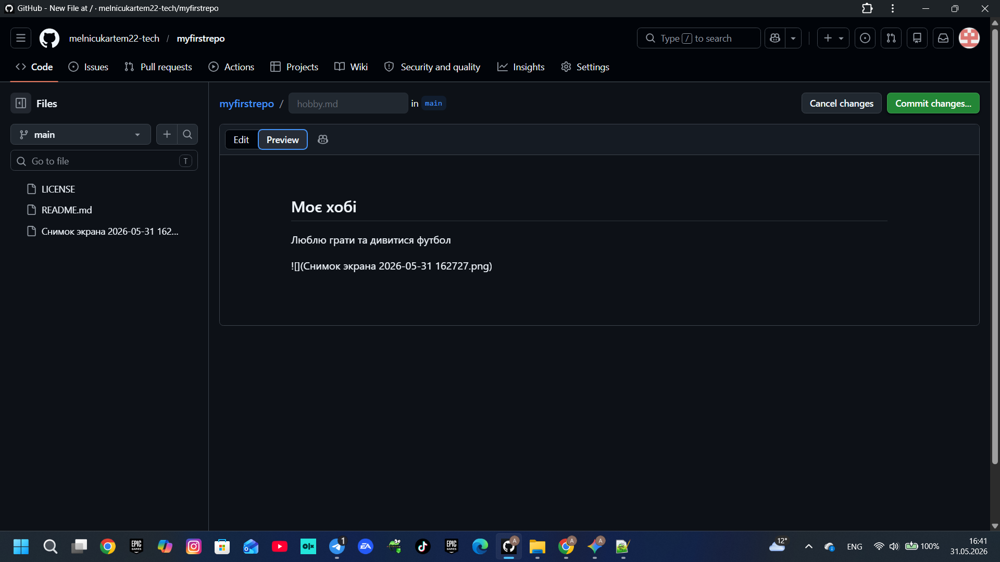
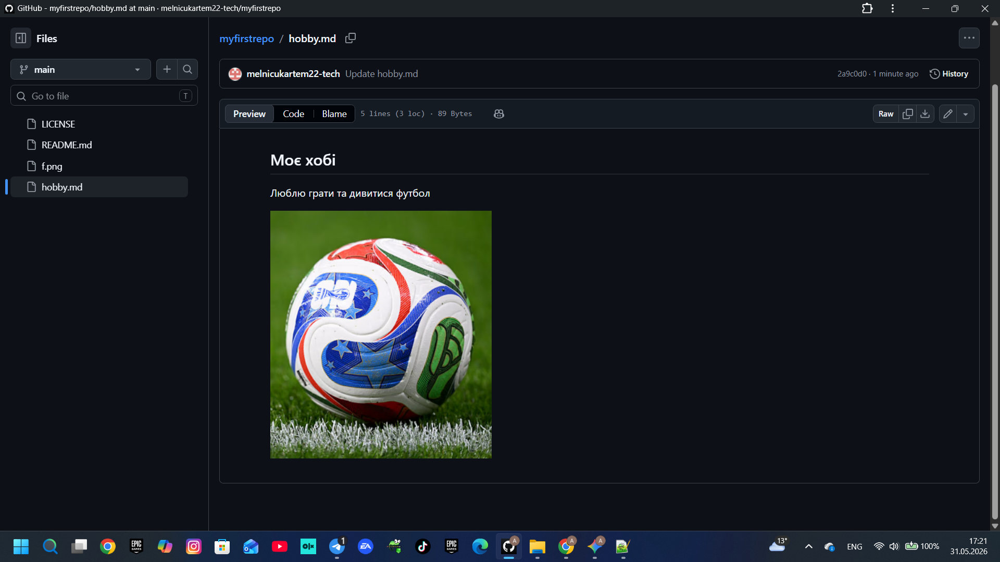
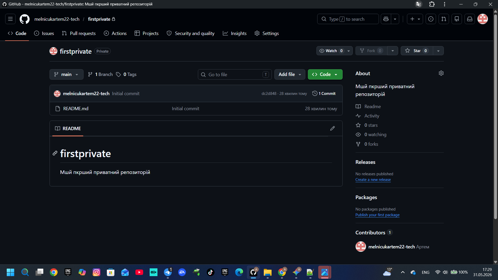

# Звіт з лабораторної роботи №1
## Тема: Основи роботи з MarkDown та робота з платформою GitHub

**Виконав:** студент групи [Ваша група]  
**ПІБ:** [Ваше ПІБ]  
**Прийняв:** [ПІБ викладача]  

---

### Мета роботи:
1. Закріпити на практиці принципи роботи та правила оформлення текстових документів за допомогою мови розмітки Markdown.
2. Ознайомитися з платформою GitHub, навчитися створювати та налаштовувати публічні й приватні репозиторії.
3. Опанувати базові навички хостингу статичних веб-сторінок через сервіс GitHub Pages.
4. Навчитися взаємодіяти у межах платформи (коментування через Issues, спільна робота через додавання Collaborators).

---

## 1. Теоретичні відомості
**Markdown** — це полегшена мова розмітки даних, створена для написання максимально читабельного текстового коду, який легко конвертується в структуровану розмітку HTML. Основні елементи включають заголовки різного рівня (`#`, `##`), списки, виділення тексту та вбудовування медіафайлів.

**GitHub** — хмарна платформа, що базується на системі керування версіями Git, яка дозволяє розробникам спільно працювати над проєктами, відстежувати зміни у файлах, вести обговорення (Issues/Discussions) та публікувати документацію чи сайти.

---

## 2. Хід виконання роботи

### Етап 1. Локальна робота з Markdown (Notepad++ та Typora)
1. На локальному комп'ютері було встановлено текстовий редактор **Notepad++** та активовано плагін **Markdown Panel** для інтерактивного перегляду результату рендерингу тексту. Було відпрацьовано базовий синтаксис: створення списків, виділення блоків коду та заголовків.

 

*Рис 1. Створення теоретичної частини Markdown в Notepad++.*

2. Для роботи зі складнішими елементами (формулами LaTeX та діаграмами Mermaid) було встановлено спеціалізований редактор **Typora**. У налаштуваннях програми активовано підтримку формул у рядку та графіків. Оформлено структуру документа та перевірено відносні шляхи до картинок.

  

*Рис 2. Фінальне оформлення звіту у програмі Typora.*

---

### Етап 2. Реєстрація на GitHub та робота з публічним репозиторієм
1. Пройдено процедуру реєстрації облікового запису на платформі GitHub під унікальним нікнеймом.
2. Здійснено перехід до глобального відкритого репозиторію `pupenasan/Git4All` у вкладку **Issues**. Було створено перший тестовий коментар у гілці обговорення, де протестовано режим `Preview` та успішно надіслано повідомлення. Після цього налаштовано аватарку та профіль.
3. Створено новий **публічний (Public)** репозиторій під назвою `myfirstrepo` з автоматичним додаванням файлу `README.md` та ліцензії MIT.
4. У репозиторії створено сторінку `hobby.md` про власне хобі. За допомогою Markdown-тегу додано зображення, яке попередньо завантажили в корінь сховища.

  
*Рис 3. Процес створення файлу hobby.md в інтерфейсі GitHub.*

  
*Рис 4. Перегляд відрендереної сторінки про хобі в браузері.*

---

### Етап 3. Налаштування вебсайту (GitHub Pages)
1. У налаштуваннях репозиторію `myfirstrepo` перейшли до розділу **Settings -> Pages**.
2. Як джерело для розгортання сайту було вказано головну гілку `main`. Після збереження сервіс згенерував пряме посилання на сайт.
3. У головний файл `README.md` було додано розділ «Про себе» та відносне посилання на сторінку хобі: `[Хоббі](hobby.md)`.
4. У вкладці **Actions** перевірено статус збірки (Deployment) — процес пройшов успішно, про що свідчать зелені маркери.

  
*Рис 5. Стан публічного репозиторію myfirstrepo та вміст головного README.md.*

---

### Етап 4. Створення приватного репозиторію та робота з Collaborators
1. Створено другий репозиторій під назвою `firstprivate`. Під час створення було обрано тип доступу **Private (Приватний)**. Доступ до цього репозиторію обмежений: його вміст не відображається стороннім користувачам.

  
*Рис 6. Перелік репозиторіїв у профілі: розділення на приватний та публічний.*

2. Через меню **Settings -> Collaborators** надіслано офіційне запрошення іншому користувачу (викладачу/одногрупнику) для надання прав спільного редагування та перегляду коду сховища.

  
*Рис 7. Головна сторінка приватного репозиторію firstprivate.*

---

## Висновки
На практиці було детально вивчено правила оформлення текстових документів за допомогою мови розмітки **Markdown**. Отримано базові навички роботи з репозиторіями **GitHub**:
* Навчилиcя створювати та конфігурувати публічні й приватні сховища проєктів.
* Опанували інструменти завантаження та редагування файлів безпосередньо через веб-інтерфейс (браузер).
* Налаштували автоматичну публікацію текстових файлів у вигляді статичного сайту через **GitHub Pages**.
* Розібралися з принципами адресації медіафайлів за допомогою *відносних шляхів* (відносно кореня папки/репозиторію), що забезпечує правильне відображення картинок на будь-якому пристрої та хостингу.