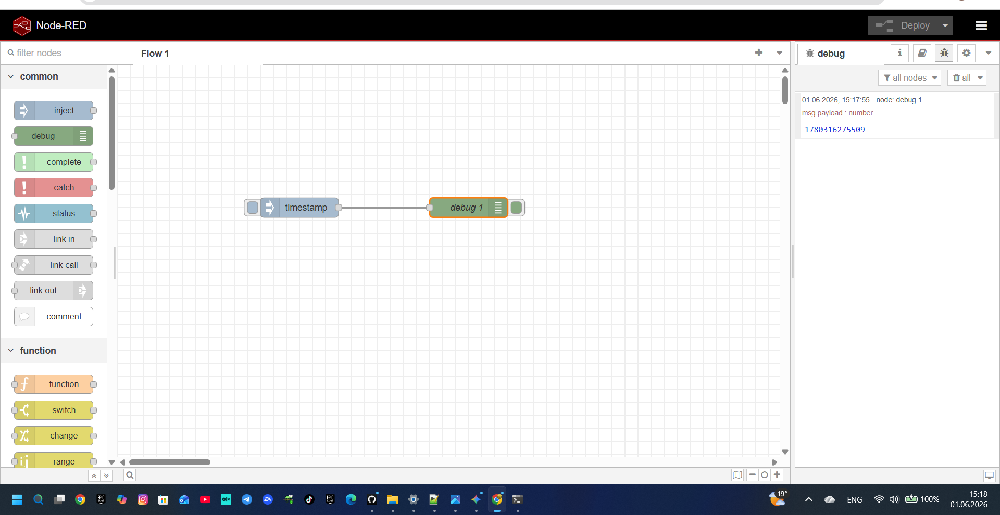
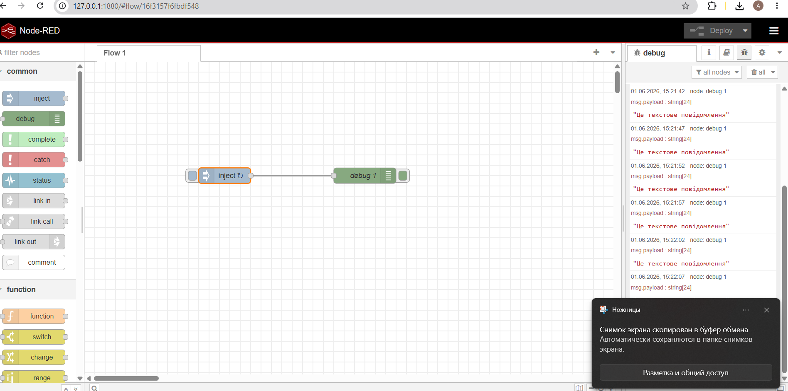
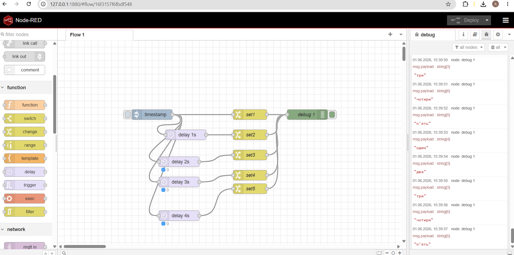
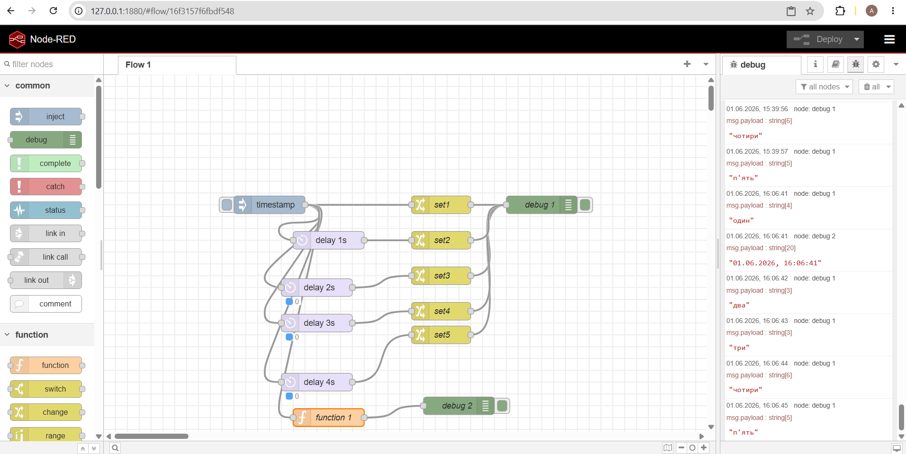
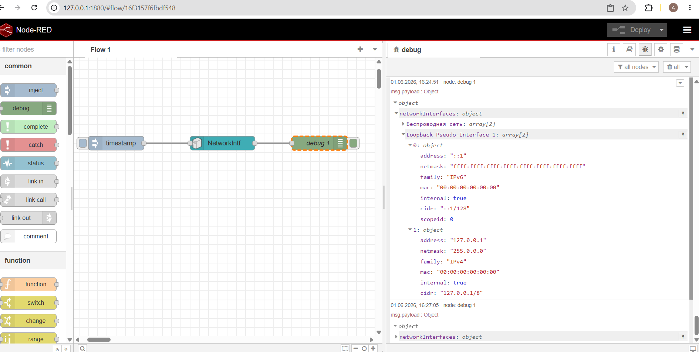

# Лабораторна робота №3. Основи роботи з Node-RED

**Дисципліна:** Автоматизація, комп'ютерні технології та робототехніка  

**Виконав:** студент групи КС 1-2

**ПІБ:** Мельничук Артем Євгенійович

**Мета роботи:** Ознайомлення з можливостями та принципами побудови потоків керування в графічному середовищі розробки Node-RED, робота з типами даних, затримками, JavaScript-функціями та системними об'єктами.

---

## Хід виконання роботи

[Завантажити lab3.json](lab3.json)

### 1. Інсталяція та запуск середовища Node-RED
Було проведено перевірку встановлених версій середовища виконання Node.js та пакетного менеджера npm через командний рядок Windows:
* Версія Node.js: `v24.16.0`
* Версія npm: `11.13.0`

За допомогою команди `npm install -g --unsafe-perm node-red` було розгорнуто платформу Node-RED та запущено локальний сервер (`node-red`). Вхід до веб-інтерфейсу розробника виконано за адресою `http://127.0.0.1:1880/`.

### 2. Створення базового потоку (Inject & Debug)
На робочу область додано базові вузли: `inject` (ініціатор повідомлення) та `debug` (виведення результату в консоль). Після виконання деплою (`Deploy`) та активації вузла було отримано відмітку часу в мілісекундах (Timestamp).



---

### 3. Налаштування періодичного надсилання текстових повідомлень
Вузол типу `inject` було модифіковано: тип корисного навантаження (`msg.payload`) змінено на рядковий (*string*), а також налаштовано автоматичний повтор з інтервалом кожні 5 секунд. У вікні налагодження зафіксовано стабільну циклічну відправку заданого рядка тексту.



---

### 4. Використання вузлів затримки (Delay) та модифікації (Change)
Побудовано розгалужену логічну схему, яка імітує роботу послідовного конвеєра або крокового автомата. Від одного імпульсу `timestamp` сигнал розходиться на 5 паралельних гілок. Завдяки налаштуванню блоків `delay` (від 1 до 4 секунд) та блоків `change` (встановлення текстових значень від "один" до "п'ять"), у консолі отримано чіткий щосекундний вивід елементів черги.



---

### 5. Обробка даних за допомогою JavaScript (Вузол Function)
До схеми інтегровано вузол `function 1`. Написано скрипт на мові JavaScript, який зчитує сире число мілісекунд з об'єкта `msg.payload`, створює екземпляр класу `Date` та форматує його у локальний людський формат дати та часу за допомогою методу `.toLocaleString()`.

Код функції:
```javascript
msg.payload = new Date(msg.payload).toLocaleString();
return msg;